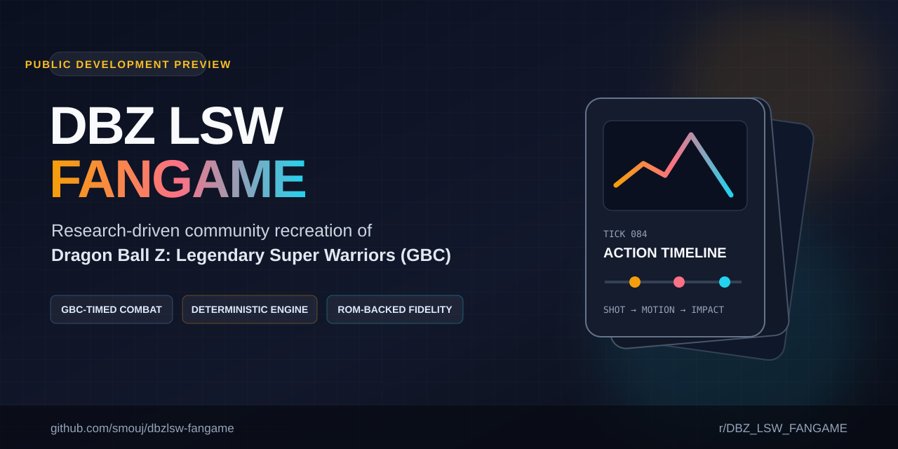

<div align="center">



# DBZ LSW Fangame

**Open-source, community-driven recreation of _Dragon Ball Z: Legendary Super Warriors_ (Game Boy Color), built around reproducible research and deterministic combat.**

[](https://github.com/smouj/dbzlsw-fangame/actions/workflows/public-safety.yml)
[](https://github.com/smouj/dbzlsw-fangame/actions/workflows/repository-health.yml)
[](#project-status)
[](LICENSE)
[](https://www.reddit.com/r/DBZ_LSW_FANGAME/)

**GBC-timed combat · deterministic runtime · ROM-backed research · PixiJS presentation · open contributions**

[Roadmap](docs/ROADMAP.md) · [Project status](docs/PROJECT_STATUS.md) · [Contributing](CONTRIBUTING.md) · [Community](docs/COMMUNITY.md) · [Fidelity model](docs/FIDELITY.md)

</div>

---

## Project status

> **Public Development Preview / Alpha** — active development. The combat/runtime architecture is already substantial, but visible battle choreography is still being brought into line with the original GBC presentation. Mechanical correctness and visual fidelity are tracked separately.

The public repository is intentionally starting from a **clean history**. It is not a mirror of private/raw ROM research and it does not distribute a ROM, save states, raw dumps or private development workspace data.

### Current technical baseline

| Area | Current state |
|---|---|
| Card database / playability | **125/125 playable** in the active development baseline |
| Battle authority | Gameplay outcomes resolve through the deterministic battle/runtime layer |
| Support / LIMIT / defense | Runtime-native; defensive CA53 semantics are applied mechanically |
| Golden Combat | **11 PASS · 4 PARTIAL · 0 BLOCKED** at the latest published project baseline |
| Remaining Golden partials | Cont.Punch · Cont.Kick · Energy Bomb · Destruct-Disk |
| Visible choreography | **Active P0** — camera/shot motion, actor-target synchronization, projectile ordering and HUD timing |
| Full-match E2E | Planned P0 for deterministic 1v1 and 2v2 matches |
| Public application source | Staged through [#1](https://github.com/smouj/dbzlsw-fangame/issues/1) after sanitization |

The project does **not** call a feature ROM-faithful merely because the final damage or state is correct. See [Fidelity](docs/FIDELITY.md).

## What this project is

**DBZ LSW Fangame** is an independent, non-commercial fan project focused on understanding and recreating the mechanics, timing, combat flow and presentation grammar of _Dragon Ball Z: Legendary Super Warriors_ for modern systems.

The active implementation is built around a deterministic TypeScript battle engine and a GBC-tick presentation pipeline. Reverse-engineering findings are treated as evidence with an explicit confidence level. Unknown behaviour remains unknown until it is demonstrated; it is not silently invented to make a test green.

This repository is the project's **public collaboration surface**:

- redistributable source code
- portable tests and verification tooling
- public-safe technical documentation
- issues and pull requests
- reproducible derived ROM findings
- community planning and contributor onboarding

Raw/local ROM work and non-redistributable material stay outside the public repository.

## Current development focus

The highest-priority work is visible combat fidelity:

```text
player command / card
        ↓
BattleRuntime (single gameplay authority)
        ↓
deterministic EventLog
        ↓
GBC-timed presentation timeline
        ↓
camera / shot / viewport
        ↓
actor + target frames and motion
        ↓
projectile / FX lifecycle
        ↓
impact / defense / damage / KO
        ↓
HUD / hand timing
        ↓
return to the correct control boundary
```

The current P0 board starts with:

- [#2 — Make GBC camera and shot choreography visible in production](https://github.com/smouj/dbzlsw-fangame/issues/2)
- [#3 — Close remaining Golden Combat physical sequence gaps](https://github.com/smouj/dbzlsw-fangame/issues/3)
- [#4 — Add deterministic full-battle E2E gates for 1v1 and 2v2](https://github.com/smouj/dbzlsw-fangame/issues/4)

## Screenshots and visual progress

Public screenshots are curated from the current development build. They must represent the actual application state and must not contain private debug overlays, local paths, credentials or internal workspace data.

A public development screenshot and project description are available in the community announcement:

- [Development preview on r/IndieGames](https://www.reddit.com/r/indiegames/comments/1vpzm0h/i_am_recreating_dragon_ball_z_legendary_super/)

The repository-native screenshot gallery is being imported through the same public-source review used for the first application snapshot, so images are not copied blindly from private history. See [Screenshot policy](docs/SCREENSHOTS.md).

## Technology

The active implementation uses:

- **TypeScript** — deterministic gameplay/runtime and tooling
- **React** — application shell and accessible UI
- **PixiJS** — battle presentation, actors, projectiles and cinematic viewport
- **Vite** — development/build pipeline
- **Vitest** — unit and contract verification
- **Playwright** — browser/E2E verification
- **GBC tick clock** — presentation and runtime timing derived from the original system model

The public contributor interface will remain small even when specialist verification grows underneath it.

## Contributing

Contributions are welcome from developers, reverse engineers, testers, technical artists and documentation contributors.

### Ways to help

| Area | Useful contributions |
|---|---|
| Engine / gameplay | legality, deterministic state transitions, combat rules, AI |
| Renderer | PixiJS camera, actor/target synchronization, projectile/FX lifecycle |
| ROM research | reproducible derived findings, timing, handlers, sequence evidence |
| QA | deterministic reproductions, browser E2E, viewport regressions |
| Animation | physical frame provenance, sequence/tick validation |
| Documentation | architecture, research notes, onboarding, diagrams |
| Accessibility / UI | keyboard flow, responsive layouts, readable game UI |

Start with [CONTRIBUTING.md](CONTRIBUTING.md), then check [open issues](https://github.com/smouj/dbzlsw-fangame/issues). Small, evidence-backed changes are preferred over broad speculative rewrites.

### Public contribution workflow

```text
fork
  ↓
focused branch
  ↓
portable checks
  ↓
pull request + evidence
  ↓
review
  ↓
squash merge
```

Until the sanitized application snapshot in issue #1 lands, this repository contains the public project contract, roadmap and governance rather than the complete runnable application tree. That status is deliberate and will be removed as soon as the public source gate is satisfied.

## Community

- **GitHub Issues** — bugs, actionable work and verified fidelity discrepancies
- **GitHub Pull Requests** — implementation and documentation contributions
- **Reddit** — [r/DBZ_LSW_FANGAME](https://www.reddit.com/r/DBZ_LSW_FANGAME/) for development updates and community discussion
- **X / Twitter** — no account is linked until an official project handle is explicitly verified by the maintainer

See [docs/COMMUNITY.md](docs/COMMUNITY.md) for routing and community rules.

## ROM and asset policy

**No game ROM is distributed by this repository.**

Do not commit:

- `.gb`, `.gbc` or generic ROM images
- save states / SRAM dumps
- raw ROM dumps or extracted proprietary audio dumps
- private workspace state or developer memory files
- credentials, tokens, local machine paths or personal environment files
- unreviewed extracted asset corpora

ROM-dependent local research uses a contributor's own legally obtained copy and keeps local/generated material untracked unless a specific derived artefact has been reviewed for public distribution.

See [Public Source Policy](docs/PUBLIC_SOURCE_POLICY.md) and [ROM Research Policy](docs/ROM_RESEARCH_POLICY.md).

## Documentation

| Document | Purpose |
|---|---|
| [Architecture](docs/ARCHITECTURE.md) | Runtime/presentation authority and system boundaries |
| [Project status](docs/PROJECT_STATUS.md) | Honest current development state |
| [Roadmap](docs/ROADMAP.md) | Public priorities and sequencing |
| [Fidelity](docs/FIDELITY.md) | Evidence levels and completion criteria |
| [Development](docs/DEVELOPMENT.md) | Contributor environment and workflow |
| [Community](docs/COMMUNITY.md) | Official channels and where to report what |
| [Branding](docs/BRANDING.md) | Name, descriptions, topics and social preview |
| [Screenshots](docs/SCREENSHOTS.md) | Public media curation rules |
| [Public Source Policy](docs/PUBLIC_SOURCE_POLICY.md) | Public/private distribution boundary |
| [ROM Research Policy](docs/ROM_RESEARCH_POLICY.md) | How ROM-derived claims are documented safely |
| [Maintainer Setup](docs/MAINTAINER_SETUP.md) | GitHub metadata/ruleset baseline |

## Legal and project scope

This is an **unofficial, non-commercial fan project**. It is not affiliated with, endorsed by, sponsored by or approved by the rights holders of _Dragon Ball_, _Dragon Ball Z_ or _Dragon Ball Z: Legendary Super Warriors_.

The [MIT License](LICENSE) applies only to original source code and documentation contributed under that license. It does **not** grant rights to third-party trademarks, characters, artwork, music, ROM data or other copyrighted game material.

See [NOTICE.md](NOTICE.md) for the project notice.
